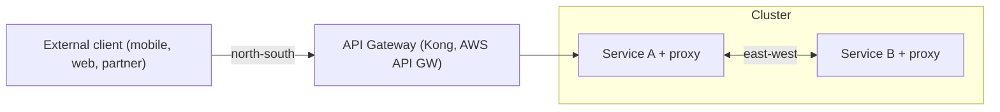
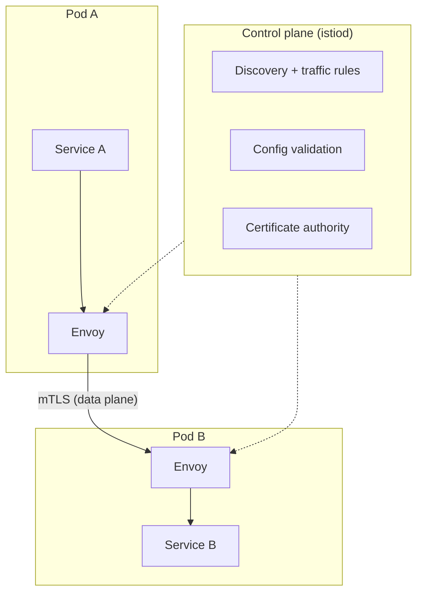

# API Gateway vs Service Mesh: Field Notes

Simple-English notes with a hands-on sample project (Istio on `kind`).
Based on the newsletter post "API Gateway vs Service Mesh". Extra tips come from running this in production.

## Contents
1. [The 30-second version](#1-the-30-second-version)
2. [API Gateway vs Service Mesh](#2-api-gateway-vs-service-mesh)
3. [Before vs after a mesh](#3-before-vs-after-a-mesh)
4. [How Istio works](#4-how-istio-works)
5. [Key takeaways](#5-key-takeaways)
6. [Sample project: `mesh-demo`](#6-sample-project-mesh-demo)
7. [Cheat sheet](#7-cheat-sheet)
8. [Gotchas from real life](#8-gotchas-from-real-life)
9. [When NOT to use a mesh](#9-when-not-to-use-a-mesh)

---

## 1. The 30-second version

- **API Gateway** = the front door. It handles traffic **coming into** the cluster from outside (north-south).
- **Service mesh** = the internal phone system. It handles calls **between your services** inside the cluster (east-west).
- Real setups often use **both**: Kong / AWS API Gateway at the edge, Istio / Linkerd inside.
- A mesh puts a small **proxy next to every app** (a sidecar). Retries, mTLS, rate limits and metrics move out of your code and into that proxy.
- Price you pay: more moving parts, and one extra container in every Pod.

---

## 2. API Gateway vs Service Mesh



| | API Gateway | Service Mesh |
|---|---|---|
| Traffic direction | North-south (outside to inside) | East-west (service to service) |
| Where it lives | At the cluster edge | Inside, beside every Pod |
| Who it serves | External consumers | Your own services |
| Typical jobs | API keys, per-consumer throttling, payload transformation, billing | mTLS, retries, timeouts, traffic policy, per-request metrics |
| Examples | Kong, AWS API Gateway | Istio, Linkerd |

**Why people mix them up:** both do auth, rate limiting and routing. The difference is *where* they sit and *which traffic* they touch.

**Why not use just one?**
- Mesh only: you lose API key management and per-consumer billing. Gateways are built for that.
- Gateway only: every internal call goes through one central choke point, which adds latency. A mesh lets services talk directly, proxy to proxy.

---

## 3. Before vs after a mesh

**Before:** every service has retry logic, TLS, auth, metrics and rate limiting written *inside* its own code.

**After:** those move to the proxy. The service keeps only business logic.

Why this matters: with 20 microservices in 5 languages, you would write retries and mTLS 20 times. A Go retry library and a Python one never behave the same. A mesh enforces the same behaviour everywhere, no matter the language.

---

## 4. How Istio works

Two layers:

- **Data plane**: Envoy proxies, one per Pod (injected automatically as a sidecar). They carry the real traffic.
- **Control plane**: `istiod`. It tells every proxy what to do.



What happens when Service A calls Service B:

1. A's code makes a normal call. It does not know about the mesh.
2. The call goes to the **local Envoy** first.
3. That Envoy encrypts it (mTLS), applies retry/timeout rules, then sends it on.
4. **B's Envoy** decrypts it and hands it to B.

`istiod` replaced three older components: Pilot (discovery, traffic rules), Citadel (certificates), Galley (config validation).

---

## 5. Key takeaways

- `kube-proxy` and the CNI plugin move packets between Pods but cannot see individual requests. That makes native Kubernetes networking hard to debug.
- A mesh gives **per-request visibility**.
- Retries, mTLS and rate limits become **language-independent**.
- A call between two meshed services always passes through **two** Envoys (sender's and receiver's).
- The cost is real: an extra container in every Pod, and two layers to debug (app + proxy).

---

## 6. Sample project: `mesh-demo`

Goal: see each idea from the post working on a laptop.

| Idea from the post | Demo |
|---|---|
| Sidecar in every Pod | Pods show `2/2` containers |
| Per-request visibility | Read the Envoy access log |
| mTLS without app changes | Non-mesh Pod is rejected |
| Retries move out of code | Flaky backend becomes reliable |
| Gateway handles north-south | Istio ingress gateway routes outside traffic |

**Needs:** Docker, `kubectl`, [`kind`](https://kind.sigs.k8s.io/), [`istioctl`](https://istio.io/latest/docs/setup/getting-started/). Manifests below use `networking.istio.io/v1` (Istio 1.22+; use `v1beta1` on older versions).

### Repo layout

```
mesh-demo/
├── 00-namespaces.yaml
├── 01-backend.yaml
├── 02-clients.yaml
├── 03-mtls-strict.yaml
├── 04-traffic-policy.yaml
└── 05-edge.yaml
```

### `00-namespaces.yaml`

```yaml
apiVersion: v1
kind: Namespace
metadata:
  name: shop
  labels:
    istio-injection: enabled   # sidecars are injected here
---
apiVersion: v1
kind: Namespace
metadata:
  name: legacy                 # no injection: plays a non-mesh workload
```

### `01-backend.yaml`

`httpbin` is a handy test server. `/status/200,500` returns a random pick of those codes, so it acts as a flaky service.

```yaml
apiVersion: apps/v1
kind: Deployment
metadata:
  name: backend
  namespace: shop
spec:
  replicas: 2
  selector:
    matchLabels: {app: backend}
  template:
    metadata:
      labels: {app: backend, version: v1}
    spec:
      containers:
        - name: httpbin
          image: kennethreitz/httpbin   # amd64 image; runs emulated on Apple Silicon
          ports:
            - containerPort: 80
---
apiVersion: v1
kind: Service
metadata:
  name: backend
  namespace: shop
spec:
  selector: {app: backend}
  ports:
    - name: http          # port name matters to Istio (see Gotchas)
      port: 80
      targetPort: 80
```

### `02-clients.yaml`

One client inside the mesh, one outside.

```yaml
apiVersion: apps/v1
kind: Deployment
metadata:
  name: client
  namespace: shop
spec:
  replicas: 1
  selector:
    matchLabels: {app: client}
  template:
    metadata:
      labels: {app: client}
    spec:
      containers:
        - name: curl
          image: curlimages/curl
          command: ["sleep", "86400"]
---
apiVersion: apps/v1
kind: Deployment
metadata:
  name: client
  namespace: legacy
spec:
  replicas: 1
  selector:
    matchLabels: {app: client}
  template:
    metadata:
      labels: {app: client}
    spec:
      containers:
        - name: curl
          image: curlimages/curl
          command: ["sleep", "86400"]
```

### `03-mtls-strict.yaml`

```yaml
apiVersion: security.istio.io/v1
kind: PeerAuthentication
metadata:
  name: default
  namespace: shop
spec:
  mtls:
    mode: STRICT     # only accept mTLS traffic
```

### `04-traffic-policy.yaml`

Retries and timeouts live in config, not in app code.

```yaml
apiVersion: networking.istio.io/v1
kind: VirtualService
metadata:
  name: backend
  namespace: shop
spec:
  hosts: ["backend"]
  http:
    - route:
        - destination:
            host: backend
      timeout: 5s          # total budget for the request
      retries:
        attempts: 3        # up to 3 retries after the first try
        perTryTimeout: 2s
        retryOn: 5xx
```

### `05-edge.yaml`

North-south path: outside client, ingress gateway, backend.

```yaml
apiVersion: networking.istio.io/v1
kind: Gateway
metadata:
  name: shop-gateway
  namespace: shop
spec:
  selector:
    istio: ingressgateway
  servers:
    - port: {number: 80, name: http, protocol: HTTP}
      hosts: ["shop.local"]
---
apiVersion: networking.istio.io/v1
kind: VirtualService
metadata:
  name: backend-edge
  namespace: shop
spec:
  hosts: ["shop.local"]
  gateways: ["shop-gateway"]
  http:
    - route:
        - destination:
            host: backend
            port: {number: 80}
```

### Run it

**Setup**

```bash
kind create cluster --name mesh-demo

# demo profile includes istiod + ingress gateway; access log lets us see requests
istioctl install --set profile=demo --set meshConfig.accessLogFile=/dev/stdout -y

kubectl apply -f 00-namespaces.yaml -f 01-backend.yaml -f 02-clients.yaml
kubectl -n shop wait --for=condition=available deploy --all --timeout=180s
kubectl -n legacy wait --for=condition=available deploy --all --timeout=180s
```

**Experiment 1: the sidecar**

```bash
kubectl -n shop get pods      # READY 2/2  (app + istio-proxy)
kubectl -n legacy get pods    # READY 1/1  (no sidecar)
```

**Experiment 2: per-request visibility**

```bash
kubectl -n shop exec deploy/client -c curl -- curl -s http://backend/get | head -n 5
kubectl -n shop logs deploy/client -c istio-proxy --tail=3
```

The log shows method, path, status code, upstream host and timing. Native Kubernetes networking cannot show you this.

**Experiment 3: mTLS with zero app changes**

```bash
# Default mode is PERMISSIVE, so the non-mesh client still works
kubectl -n legacy exec deploy/client -- curl -s -o /dev/null -w "%{http_code}\n" http://backend.shop/get   # 200

kubectl apply -f 03-mtls-strict.yaml

# Now the non-mesh client is rejected (curl prints 000, connection reset)
kubectl -n legacy exec deploy/client -- curl -s -m 3 -o /dev/null -w "%{http_code}\n" http://backend.shop/get

# The meshed client still works
kubectl -n shop exec deploy/client -c curl -- curl -s -o /dev/null -w "%{http_code}\n" http://backend/get   # 200
```

**Experiment 4: retries and timeouts**

```bash
flaky() {
  kubectl -n shop exec deploy/client -c curl -- sh -c \
    'for i in $(seq 1 20); do curl -s -o /dev/null -w "%{http_code}\n" http://backend/status/200,500; done' \
    | sort | uniq -c
}

flaky                                   # roughly half 200s, half 500s
kubectl apply -f 04-traffic-policy.yaml
flaky                                   # almost all 200s (about 1 in 16 still fails)

# Timeout: expect a 504 after about 5s
kubectl -n shop exec deploy/client -c curl -- \
  curl -s -o /dev/null -w "%{http_code} %{time_total}s\n" http://backend/delay/10
```

The backend code never changed. Only config did.

**Experiment 5: the north-south path**

```bash
kubectl apply -f 05-edge.yaml
kubectl -n istio-system port-forward svc/istio-ingressgateway 8080:80 &
curl -s -o /dev/null -w "%{http_code}\n" -H "Host: shop.local" http://localhost:8080/get   # 200
```

The gateway reaches the backend even with STRICT mTLS because the ingress gateway is itself an Envoy inside the mesh.

> **Important:** the Istio ingress gateway is *not* a full API gateway. It has no API key management, per-consumer quotas, billing or developer portal. For those, put Kong / AWS API Gateway (or similar) in front. This is why the post says production uses both.

**Cleanup**

```bash
kind delete cluster --name mesh-demo
```

---

## 7. Cheat sheet

```bash
# Health and config
istioctl proxy-status                         # are all proxies synced with istiod?
istioctl analyze -n shop                      # lint your Istio config
kubectl get peerauthentication,virtualservice,destinationrule,gateway -A

# Debugging one Pod
istioctl proxy-config routes deploy/client -n shop
istioctl x describe pod <pod> -n shop
kubectl -n shop logs <pod> -c istio-proxy

# Injection
kubectl label ns shop istio-injection=enabled
kubectl -n shop rollout restart deploy      # existing Pods only get a sidecar after restart
```

**Envoy response flags** (in the access log, tell you *why* a request failed):

| Flag | Meaning |
|---|---|
| `NR` | No route configured |
| `UH` | No healthy upstream |
| `UF` | Upstream connection failure |
| `UT` | Upstream request timeout |
| `URX` | Retry limit exceeded |

---

## 8. Gotchas from real life

1. **Name your Service ports** (`http`, `grpc`, `tcp-...`) or set `appProtocol`. Wrong or missing names cause odd routing and missing L7 metrics.
2. **Injection happens at Pod creation.** Label the namespace, then restart old Pods.
3. **Startup race:** the app can start before its proxy is ready and fail its first calls. Set `holdApplicationUntilProxyStarts: true` in the proxy config.
4. **Retries can hurt.** Retry only idempotent calls, and cap `attempts` and `perTryTimeout`. Retries on many layers multiply load (a retry storm) and can take down an already struggling service.
5. **mTLS proves which *service* is calling, not which *user*.** You still need end-user auth (`RequestAuthentication`) and `AuthorizationPolicy`.
6. **Two layers to debug.** When something breaks, check the app logs *and* the `istio-proxy` logs. Many "app bugs" are mesh config and vice versa.
7. **Resource cost adds up.** Each sidecar uses CPU and memory. Multiply by Pod count and it becomes a real line in the bill.
8. **Migrate slowly.** Start in `PERMISSIVE` mTLS, mesh one namespace at a time, then move to `STRICT`.
9. **Sidecar-free option:** Istio also has *ambient mode*, which uses per-node proxies instead of per-Pod sidecars. Worth a look if sidecar cost or upgrade pain bothers you.

---

## 9. When NOT to use a mesh

- You have fewer than about 5 to 10 services and one or two languages. A shared library and a good ingress are usually enough.
- Nobody on the team can own it. A mesh needs someone who understands both Kubernetes networking and Envoy.
- You only need mTLS and basic metrics. Lighter tools (or Linkerd, which is simpler than Istio) may be enough.

**Rule of thumb:** adopt a mesh when the pain of doing retries, mTLS and observability *inconsistently across many services* is bigger than the pain of running a mesh.

---

## References
- Istio docs: https://istio.io/latest/docs/
- Kind: https://kind.sigs.k8s.io/
- Linkerd (simpler alternative): https://linkerd.io/